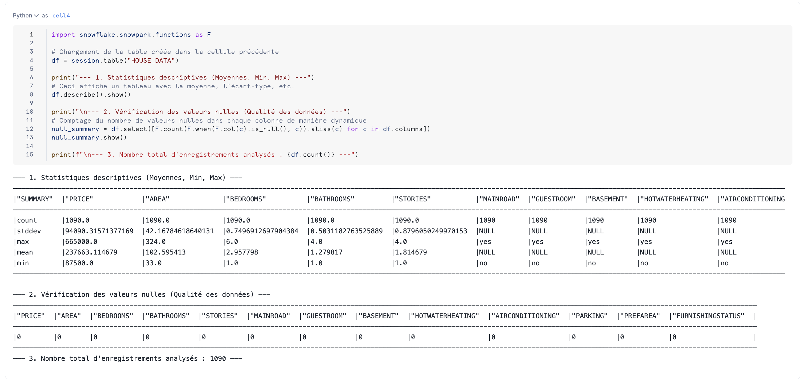
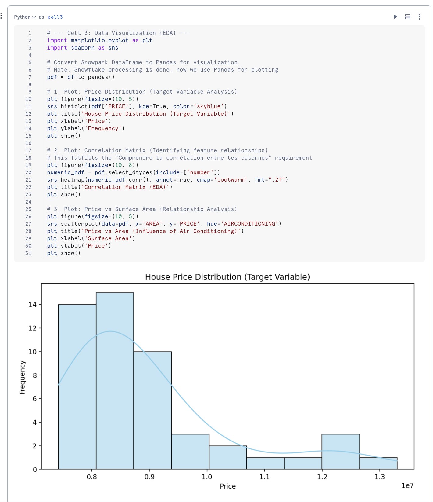
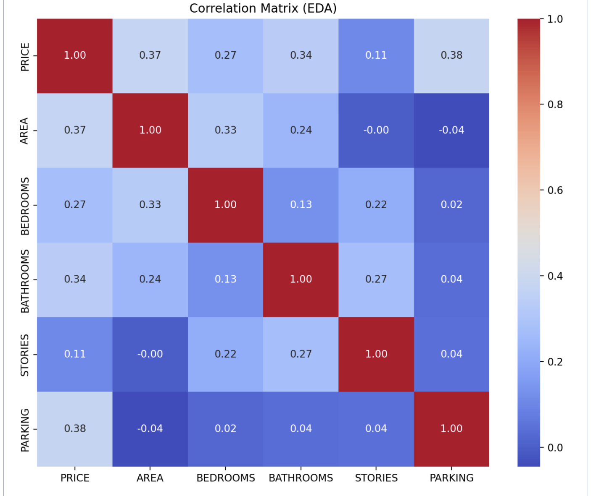
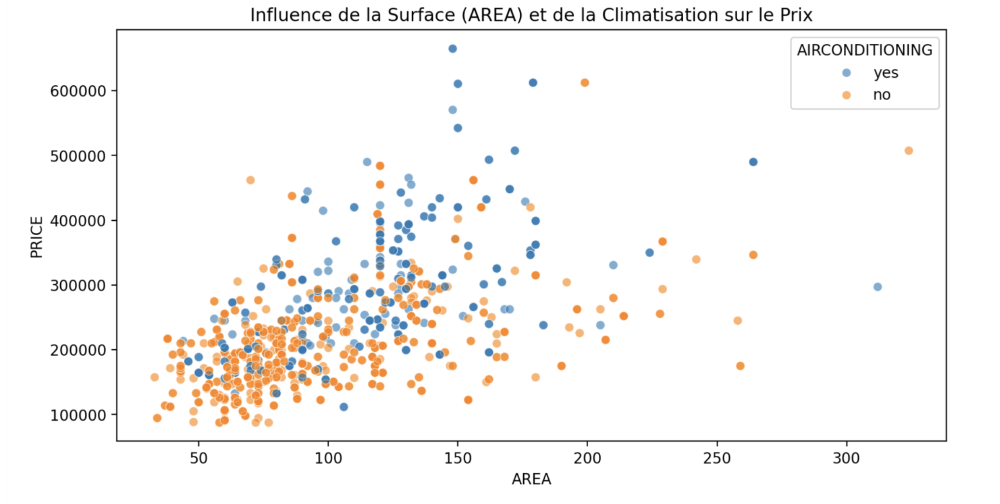

# MBAESG_2025_CLASSE_A_EVALUATION_DATAENGINEER_MLOPS
Projet Snowflake &amp; Machine Learning - Prédiction des prix des maisons

## 👥 Membres du groupe
*   **SALIMI MAZRAG AMINA** (Chef de Projet & Data Engineer)
*   **ELMAN NAJOUA** (Data Engineer / Scientist)
*   **ELFATHI HAJAR** (Data Engineer / Scientist)

## 📝 Description du Projet
Ce projet consiste à développer un pipeline complet de **Machine Learning** directement au sein de la plateforme **Snowflake**. L'objectif est de construire un modèle prédictif capable d'estimer le prix de vente des propriétés immobilières en fonction de diverses caractéristiques (surface, nombre de chambres, climatisation, etc.).

L'ensemble du workflow est réalisé sans extraction de données, en utilisant les capacités de calcul de Snowflake et de Snowpark.

## 🛠️ Technologies utilisées
*   **Snowflake** : Plateforme de données cloud et moteur de calcul.
*   **Snowpark** : Pour la manipulation des données en Python.
*   **Snowflake ML & Model Registry** : Pour l'entraînement, l'optimisation et la gestion des versions du modèle.
*   **Streamlit** : Pour la création d'une application interactive de prédiction.

## 🚀 Étapes du Workshop
1.  **Ingestion et Exploration (EDA)** : Chargement des données depuis S3 et analyse des corrélations entre les variables.
2.  **Préparation des données** : Nettoyage, encodage des variables catégorielles et normalisation.
3.  **Entraînement du modèle** : Utilisation de bibliothèques ML (Scikit-learn / XGBoost) pour entraîner les modèles.
4.  **Évaluation et Optimisation** : Calcul des métriques de performance (Accuracy, RMSE, MAE) et réglage des hyperparamètres (Grid Search).
5.  **Gouvernance (Model Registry)** : Enregistrement du meilleur modèle dans le registre Snowflake pour la mise en production.
6.  **Inférence et Application** : Développement d'une application Streamlit permettant aux utilisateurs de saisir des caractéristiques de maison et d'obtenir un prix estimé en temps réel.

## 📂 Structure du dépôt
*   `/notebooks` : Contient le Notebook Snowflake avec l'intégralité du pipeline ML.
*   `/app` : Code source de l'application Streamlit.
*   `README.md` : Documentation du projet.

## 📊 Description du Dataset
Le dataset contient des informations clés sur les caractéristiques des habitations. Voici le détail des variables :

*   **price** : Prix de vente de la maison (Variable cible).
*   **area** : Surface totale en mètres carrés.
*   **bedrooms** : Nombre de chambres.
*   **bathrooms** : Nombre de salles de bain.
*   **stories** : Nombre d'étages.
*   **mainroad** : Accès à une route principale (OUI/NON).
*   **guestroom** : Présence d'une chambre d'amis (OUI/NON).
*   **basement** : Présence d'un sous-sol (OUI/NON).
*   **hotwaterheating** : Présence d'un chauffage à eau chaude (OUI/NON).
*   **airconditioning** : Présence de la climatisation (OUI/NON).
*   **parking** : Nombre de places de stationnement.
*   **prefarea** : Située dans une zone privilégiée (OUI/NON).
*   **furnishingstatus** : État d'ameublement (meublé, semi-meublé, non meublé).

# Section 1 : Data Engineering & Exploration des Données (EDA)

## 1. Description du Dataset
Ce projet s'appuie sur un jeu de données immobilier regroupant les caractéristiques de diverses habitations ainsi que leurs prix de vente respectifs. L'objectif est de comprendre l'influence de facteurs clés (surface, nombre de pièces, équipements) sur la valeur marchande d'un bien immobilier.

### Variable Cible (Target - y)
*   **PRICE** : Le prix de vente final de la maison (Variable numérique continue).

### Variables Explicatives (Features - X)
*   **AREA** : Surface totale en mètres carrés.
*   **BEDROOMS / BATHROOMS** : Nombre de chambres et de salles de bain.
*   **STORIES** : Nombre total d'étages dans la maison.
*   **MAINROAD / AIRCONDITIONING / BASEMENT** : Variables catégorielles indiquant la présence d'infrastructures ou d'équipements spécifiques (Yes/No).
*   **PARKING** : Nombre de places de stationnement disponibles.
*   **FURNISHINGSTATUS** : État d'ameublement de la maison (Furnished, Semi-furnished, Unfurnished).

---

## 2. Processus d'Ingestion (Data Engineering)
L'ensemble du pipeline de données a été développé directement au sein de l'environnement **Snowflake** pour garantir la gouvernance et l'élasticité du traitement.

*   **Configuration de l'environnement** : Création d'une base de données dédiée `HOUSE_PRICE_DB` et d'un schéma `RAW_DATA`.
*   **Ingestion des données** : 
    *   Mise en place d'un `STAGE` externe pointant vers un bucket S3 (`s3://logbrain-datalake/...`).
    *   Définition d'un `FILE FORMAT` CSV pour structurer la lecture des fichiers bruts.
    *   Chargement des données dans la table finale `HOUSE_DATA` via la commande `COPY INTO`.
*   **Outils utilisés** : Snowflake SQL et Snowpark Python.

---

## 3. Analyse Exploratoire des Données (EDA)
Avant la phase de modélisation, une exploration approfondie a été réalisée à l'aide de **Snowpark Python**, **Matplotlib** et **Seaborn**.

### Statistiques et Qualité
*   **Vérification des données** : Le dataset a été contrôlé pour détecter d'éventuelles valeurs nulles (0 valeur manquante identifiée lors de l'ingestion).
*   **Analyses descriptives** : Calcul automatique des moyennes, écarts-types, minimums et maximums pour l'ensemble des variables numériques.

### Visualisations clés
*   **Distribution des prix** : L'analyse de la variable cible montre une distribution normale avec une légère asymétrie vers les prix élevés, typique du marché immobilier de luxe.
*   **Matrice de corrélation** : Nous avons mis en évidence une corrélation positive significative entre la surface (`AREA`) et le prix de vente (`PRICE`).
*   **Analyse catégorielle** : Visualisation de l'impact de la climatisation et de l'état d'ameublement sur la valeur des propriétés.

### 3. Analyse Exploratoire des Données (EDA)

#### A. Qualité et Statistiques des Données
Nous avons vérifié l'intégrité du dataset. On confirme l'absence de valeurs nulles et on observe des statistiques cohérentes pour les 50 premières lignes.

*Figure 1 : Aperçu des données et vérification des valeurs manquantes.*

#### B. Analyse de la Variable Cible (Price)
La distribution du prix montre que la majorité des propriétés se situent entre 8 et 10 millions, avec quelques propriétés de luxe au-delà de 12 millions.

*Figure 2 : Histogramme de la distribution des prix de vente.*

#### C. Analyse des Corrélations
La matrice de corrélation nous permet d'identifier que la surface (`AREA`) et le nombre de places de parking (`PARKING`) sont les variables les plus liées au prix.

*Figure 3 : Heatmap des corrélations entre les variables numériques.*

#### D. Relation Surface vs Prix
Ce graphique montre clairement que le prix augmente avec la surface, et que la présence de climatisation (Air Conditioning) influence positivement la valeur du bien.

*Figure 4 : Nuage de points montrant l'impact de la surface et de la clim sur le prix.*
