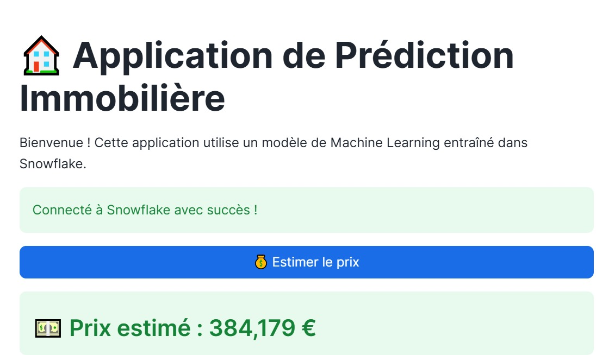
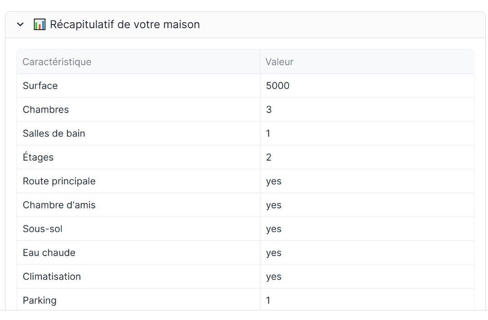

# MBAESG_2025_CLASSE_A_EVALUATION_DATAENGINEER_MLOPS
**Projet Snowflake & Machine Learning - Prédiction des prix des maisons**

## Membres du groupe
*   **SALIMI MAZRAG AMINA** (Chef de Projet & Data Engineer)
*   **EL MANSOUF NAJOUA** (Data Scientist)
*   **EL FATHI HAJAR** (Data Scientist)

---

## Description du Projet
Ce projet consiste à développer un pipeline complet de **Machine Learning** directement au sein de la plateforme **Snowflake**. L'objectif est de construire un modèle prédictif capable d'estimer le prix de vente des propriétés immobilières en fonction de diverses caractéristiques (surface, nombre de chambres, climatisation, etc.).

L'ensemble du workflow est réalisé sans extraction de données, en utilisant les capacités de calcul de Snowflake et de **Snowpark**.

## Étapes du Workshop ##
**Ingestion et Exploration (EDA)** : Chargement des données depuis S3 et analyse des corrélations entre les variables.
**Préparation des données** : Nettoyage, encodage des variables catégorielles et normalisation.
**Entraînement du modèle** : Utilisation de bibliothèques ML (Scikit-learn / XGBoost) pour entraîner les modèles.
**Évaluation et Optimisation** : Calcul des métriques de performance (Accuracy, RMSE, MAE) et réglage des hyperparamètres (Grid Search).
**Gouvernance (Model Registry)** : Enregistrement du meilleur modèle dans le registre Snowflake pour la mise en production.
**Inférence et Application** : Développement d'une application Streamlit permettant aux utilisateurs de saisir des caractéristiques de maison et d'obtenir un prix estimé en temps réel.

## Structure du dépôt ##
*   **app/** : Contient le code source de l'application interactive (`streamlit_app.py`).
*   **images/** : Dossier regroupant l'ensemble des captures d'écran, graphiques d'analyse (EDA) et métriques du modèle.
*   **notebooks/** : 
    *   `SCRIPT PYTHON SNOWFLAKE.ipynb` : Pipeline d'ingestion des données, traitement JSON et analyse exploratoire (Phase Data Engineering).
    *   `Modelisation_ML.ipynb` : Pipeline d'entraînement, optimisation des hyperparamètres et enregistrement du modèle (Phase Machine Learning).
*   **README.md** : Documentation complète du projet.

---

## Section 1 : Data Engineering & Exploration des Données (EDA)

## Description du Dataset ##

**Variable Cible (Target - y)**
**PRICE** : Le prix de vente final de la maison (Variable numérique continue).

**Variables Explicatives (Features - X)**
**AREA** : Surface totale en mètres carrés.
**BEDROOMS / BATHROOMS** : Nombre de chambres et de salles de bain.
**STORIES** : Nombre total d'étages dans la maison.
**MAINROAD / AIRCONDITIONING / BASEMENT** : Variables catégorielles indiquant la présence d'infrastructures ou d'équipements spécifiques (Yes/No).
**PARKING** : Nombre de places de stationnement disponibles.
**FURNISHINGSTATUS** : État d'ameublement de la maison (Furnished, Semi-furnished, Unfurnished).

## Processus d'Ingestion (Data Engineering) ##

L'ensemble du pipeline de données a été développé directement au sein de l'environnement Snowflake pour garantir la gouvernance et l'élasticité du traitement.

**Configuration de l'environnement** : Création d'une base de données dédiée HOUSE_PRICE_DB et d'un schéma RAW_DATA.
**Ingestion des données** :
Mise en place d'un STAGE externe pointant vers un bucket S3 (s3://logbrain-datalake/...).
Définition d'un FILE FORMAT CSV pour structurer la lecture des fichiers bruts.
Chargement des données dans la table finale HOUSE_DATA via la commande COPY INTO.
**Outils utilisés** : Snowflake SQL et Snowpark Python.

## Analyse Exploratoire des Données (EDA) ##
### 1. Configuration de l'environnement
L'initialisation du projet a été faite via un **Snowflake Notebook**. Nous avons configuré la base de données `HOUSE_PRICE_DB` et le schéma `RAW_DATA` pour garantir une structure de données propre.


*Figure 1 : Configuration de la session Snowpark et de l'espace de travail.*

### 2. Processus d'Ingestion (Data Engineering)
Les données sources étant au format **JSON (Array)** dans un bucket S3, nous avons mis en place un pipeline d'ingestion robuste :
*   **Stage S3 :** Connexion au bucket externe.
*   **Flattening :** Utilisation de la fonction `flatten()` de Snowpark pour transformer la liste JSON en lignes relationnelles.
*   **Casting :** Typage strict des données (Integer pour les prix/surfaces, String pour les catégories).


*Figure 2 : Pipeline d'aplatissage (flatten) et chargement dans la table HOUSE_DATA.*

### 3. Analyse Exploratoire des Données (EDA)

#### A. Qualité et Statistiques des Données
Le dataset contient **1090 enregistrements**. Nous avons validé l'intégrité des données : **0 valeur nulle détectée**.

*Figure 3 : Statistiques descriptives et vérification des valeurs manquantes.*

#### B. Analyse de la Variable Cible (Price)
L'histogramme montre une distribution des prix s'étendant de 87 500 à 665 000, avec une concentration majeure autour de 230 000.

*Figure 4 : Distribution de la variable cible PRICE.*

#### C. Analyse des Corrélations
La matrice de corrélation révèle que la surface (`AREA`) et le nombre de salles de bain (`BATHROOMS`) sont les facteurs les plus influents sur le prix final.

*Figure 5 : Heatmap des corrélations entre variables numériques.*

#### D. Relation Surface vs Prix
Le nuage de points confirme la corrélation positive entre la surface et et le prix, tout en mettant en évidence l'impact de la climatisation sur la valorisation du bien.

*Figure 6 : Analyse de l'impact de la surface et de l'Air Conditioning.*

# Analyse et Modélisation — Prédiction du Prix Immobilier
## Pipeline de données

### Ingestion
Les données sont chargées depuis un bucket S3 public au format **JSON** via un stage Snowflake, puis transformées en table structurée `HOUSE_PRICES` dans Snowflake.

### Feature Engineering
Les transformations suivantes ont été appliquées avant l'entraînement :

- **Encodage binaire** : les colonnes `yes/no` sont converties en `1/0`
  *(MAINROAD, GUESTROOM, BASEMENT, HOTWATERHEATING, AIRCONDITIONING, PREFAREA)*
- **Encodage ordinal** : `FURNISHINGSTATUS` → furnished=2, semi-furnished=1, unfurnished=0
- **Normalisation** : StandardScaler (moyenne=0, écart-type=1) appliqué sur toutes les features numériques
- **Split train/test** : 80% entraînement (872 lignes) / 20% test (218 lignes), `random_state=42`

---

## Résultats des modèles de base

Six modèles ont été entraînés et comparés sur le jeu de test :

| Modèle | RMSE | MAE | R² |
|--------|------|-----|----|
| **XGBoost** | **27 517** | **12 757** | **0.9151** |
| RandomForest | 32 513 | 19 587 | 0.8815 |
| GradientBoosting | 42 495 | 31 394 | 0.7975 |
| Lasso (alpha=100) | 53 968 | 40 214 | 0.6734 |
| LinearRegression | 53 985 | 40 253 | 0.6732 |
| Ridge (alpha=1) | 53 988 | 40 253 | 0.6731 |


 **XGBoost** est le meilleur modèle de base avec un R² de **0.9151**, signifiant qu'il explique 91.5% de la variance des prix. Les modèles linéaires (Linear, Ridge, Lasso) plafonnent à ~0.67, montrant que la relation entre les features et le prix est non-linéaire.


## Comparaison visuelle des modèles


## Meilleur modèle de base : XGBoost (R²=0.9151)

Le graphique ci-dessous montre les prix prédits vs les prix réels. Les points proches de la ligne rouge indiquent une bonne précision du modèle.


## Optimisation des hyperparamètres

### GridSearchCV — RandomForest
- **Nombre de combinaisons testées :** 216 candidats × 5 folds = 1 080 fits
- **Meilleurs paramètres :**

```
max_depth        = 20
max_features     = sqrt
min_samples_leaf = 1
min_samples_split= 2
n_estimators     = 300
```
- **Meilleur R² en CV :** 0.8560

### RandomizedSearchCV — XGBoost
- **Nombre de combinaisons testées :** 40 candidats × 5 folds = 200 fits
- **Meilleurs paramètres :**

```
n_estimators     = 500
max_depth        = 10
learning_rate    = 0.05
subsample        = 0.8
colsample_bytree = 0.6
reg_alpha        = 1.0
reg_lambda       = 2
```
- **Meilleur R² en CV :** 0.8606


## Comparaison avant / après optimisation

| Modèle | RMSE | R² |
|--------|------|----|
| RandomForest base | 32 513 | 0.8815 |
| RandomForest tuned | 28 217 | 0.9107 |
| XGBoost base | 27 517 | 0.9151 |
| **XGBoost tuned** | **25 594** | **0.9265** |

L'optimisation a permis de **réduire le RMSE de 7%** sur XGBoost et d'**augmenter le R² de 0.9151 à 0.9265**.


## Modèle final sélectionné : XGBoost (tuned)

| Métrique | Valeur |
|----------|--------|
| **R²** | **0.9265** |
| **RMSE** | **25 594** |
| **MAE** | **10 677** |

Le modèle explique **92.65%** de la variance des prix immobiliers sur le jeu de test. L'erreur absolue moyenne est de **10 677**, ce qui représente une précision très satisfaisante compte tenu de la distribution des prix (entre 98 000 et 665 000).


## Importance des features

Classement des features selon leur contribution au modèle XGBoost final :

| Rang | Feature | Importance |
|------|---------|-----------|
| 1 | **BATHROOMS** | 0.298 |
| 2 | AIRCONDITIONING | 0.099 |
| 3 | AREA | 0.092 |
| 4 | PARKING | 0.069 |
| 5 | STORIES | 0.065 |
| 6 | BASEMENT | 0.065 |
| 7 | GUESTROOM | 0.060 |
| 8 | FURNISHINGSTATUS | 0.059 |
| 9 | PREFAREA | 0.054 |
| 10 | MAINROAD | 0.052 |
| 11 | BEDROOMS | 0.043 |
| 12 | HOTWATERHEATING | 0.043 |


> **Interprétation :** Le nombre de salles de bain (`BATHROOMS`) est de loin le facteur le plus déterminant (29.8%), suivi de la présence de la climatisation (9.9%) et de la surface (9.2%). Le chauffage à eau chaude (`HOTWATERHEATING`) est le facteur le moins influent (4.3%).


## Analyse des résidus

L'analyse des résidus du modèle XGBoost (tuned) confirme sa qualité :

- **Distribution des résidus** : centrée autour de 0, avec une légère asymétrie sur les valeurs extrêmes
- **Résidus vs valeurs prédites** : bien distribués horizontalement autour de 0, sans pattern systématique
- Ces deux indicateurs confirment que le modèle ne souffre pas de biais structurel


## Stockage dans le Snowflake Model Registry

Le modèle final a été enregistré dans le **Snowflake Model Registry** :

```
Modèle   : HOUSE_PRICE_MODEL
Version  : V1
Registry : HOUSE_PRICE_DB.ML_SCHEMA
Stage    : @HOUSE_PRICE_DB.ML_SCHEMA.model_stage
R²       : 0.9265
RMSE     : 25 594
MAE      : 10 677
```


## Technologies utilisées

| Outil | Usage |
|-------|-------|
| **Snowflake** | Plateforme de données et exécution |
| **Snowpark** | Manipulation des données en Python |
| **Snowflake Notebooks** | Environnement de développement |
| **Snowflake Model Registry** | Versioning et stockage du modèle |
| **scikit-learn** | Modèles ML, preprocessing, validation croisée |
| **XGBoost** | Modèle final retenu |
| **pandas / numpy** | Manipulation des données |
| **matplotlib / seaborn** | Visualisation |
| **Streamlit in Snowflake** | Application utilisateur finale |


# Section 3 — MLOps, Inférence & Application Streamlit

## Enregistrement dans le Snowflake Model Registry

Le modèle final a été enregistré dans le **Snowflake Model Registry** avec support d'inférence en Warehouse :

| Propriété | Valeur |
|-----------|--------|
| **Modèle** | HOUSE_PRICE_MODEL |
| **Version** | V1 |
| **Registry** | HOUSE_PRICE_DB.ML_SCHEMA |
| **Stage** | @HOUSE_PRICE_DB.ML_SCHEMA.model_stage |
| **Platform** | WAREHOUSE |
| **R²** | 0.9265 |
| **RMSE** | 25 594 |
| **MAE** | 10 677 |

---

## Création d'une UDF Snowflake pour l'inférence

Pour permettre l'inférence depuis Streamlit sans dépendances externes, une **Python UDF** a été créée directement dans Snowflake :

| Propriété | Valeur |
|-----------|--------|
| **Nom** | `ML_SCHEMA.PREDICT_HOUSE_PRICE` |
| **Langage** | Python 3.11 |
| **Packages** | scikit-learn, xgboost, pandas, cloudpickle |
| **Imports** | `best_model.pkl.gz`, `scaler.pkl.gz` depuis `@model_stage` |
| **Fonctionnement** | Reçoit les 12 caractéristiques, applique le scaler et retourne le prix prédit |

---

## Application Streamlit

### Description
Une application interactive développée avec **Streamlit in Snowflake** permet à n'importe quel utilisateur d'estimer le prix d'une maison en temps réel, sans aucune connaissance technique.

### Fonctionnalités
- Formulaire de saisie des 12 caractéristiques de la maison dans la sidebar
- Appel à la UDF Snowflake via SQL pour obtenir la prédiction
- Affichage du prix estimé en euros
- Tableau récapitulatif des caractéristiques saisies


### Exemple de prédiction
Pour une maison de **5 000 sqft**, **3 chambres**, **1 salle de bain**, **2 étages**, avec climatisation :

| Interface de Prédiction | Récapitulatif des Saisies |
| :---: | :---: |
|  |  |

> 💵 **Prix estimé : 384 179 €**
> Le modèle traite les caractéristiques en temps réel via une UDF Snowflake et retourne l'estimation instantanément.
