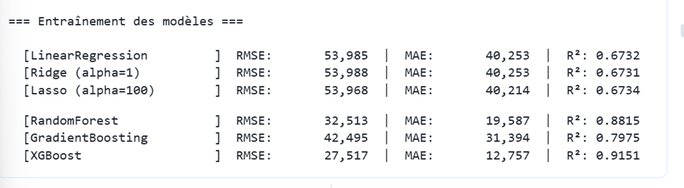
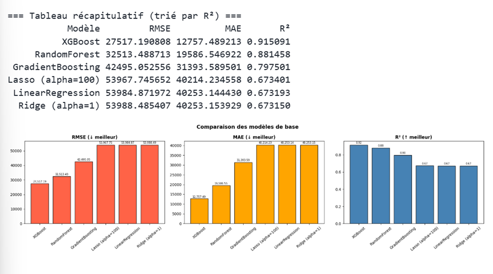
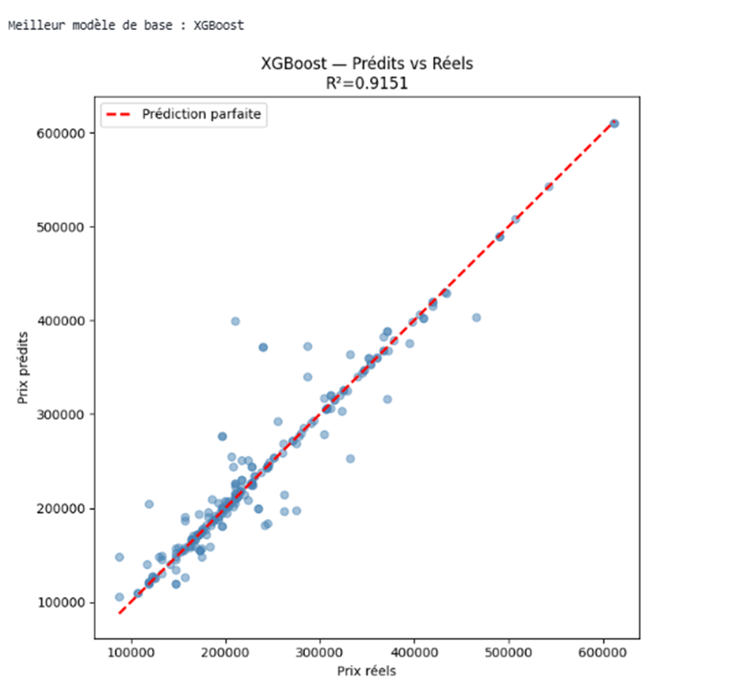
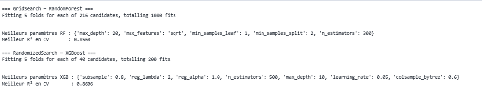
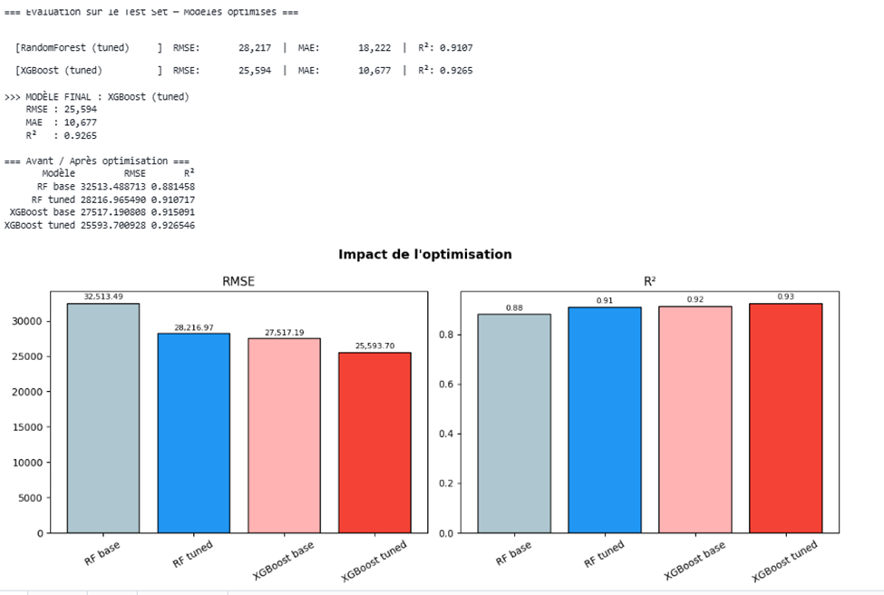
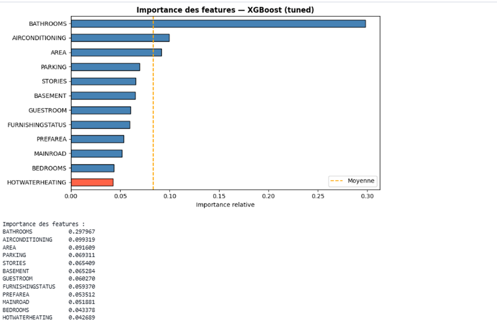
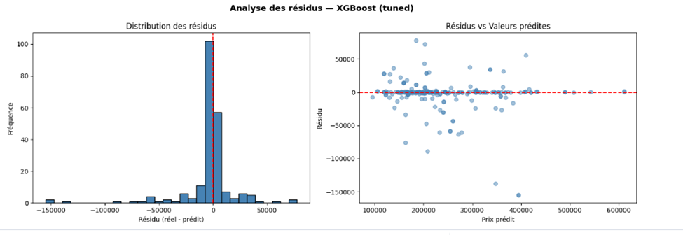
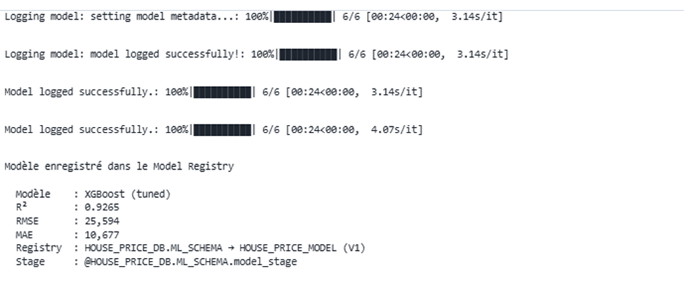

# MBAESG_2025_CLASSE_A_EVALUATION_DATAENGINEER_MLOPS
Projet Snowflake &amp; Machine Learning - Prédiction des prix des maisons

## Membres du groupe
*   **SALIMI MAZRAG AMINA** (Chef de Projet & Data Engineer)
*   **EL MANSOUF NAJOUA** (Data Engineer / Scientist)
*   **EL FATHI HAJAR** (Data Engineer / Scientist)

## Description du Projet
Ce projet consiste à développer un pipeline complet de **Machine Learning** directement au sein de la plateforme **Snowflake**. L'objectif est de construire un modèle prédictif capable d'estimer le prix de vente des propriétés immobilières en fonction de diverses caractéristiques (surface, nombre de chambres, climatisation, etc.).

L'ensemble du workflow est réalisé sans extraction de données, en utilisant les capacités de calcul de Snowflake et de Snowpark.

## Technologies utilisées
*   **Snowflake** : Plateforme de données cloud et moteur de calcul.
*   **Snowpark** : Pour la manipulation des données en Python.
*   **Snowflake ML & Model Registry** : Pour l'entraînement, l'optimisation et la gestion des versions du modèle.
*   **Streamlit** : Pour la création d'une application interactive de prédiction.

## Étapes du Workshop
1.  **Ingestion et Exploration (EDA)** : Chargement des données depuis S3 et analyse des corrélations entre les variables.
2.  **Préparation des données** : Nettoyage, encodage des variables catégorielles et normalisation.
3.  **Entraînement du modèle** : Utilisation de bibliothèques ML (Scikit-learn / XGBoost) pour entraîner les modèles.
4.  **Évaluation et Optimisation** : Calcul des métriques de performance (Accuracy, RMSE, MAE) et réglage des hyperparamètres (Grid Search).
5.  **Gouvernance (Model Registry)** : Enregistrement du meilleur modèle dans le registre Snowflake pour la mise en production.
6.  **Inférence et Application** : Développement d'une application Streamlit permettant aux utilisateurs de saisir des caractéristiques de maison et d'obtenir un prix estimé en temps réel.

## Structure du dépôt
*   `/notebooks` : Contient le Notebook Snowflake avec l'intégralité du pipeline ML.
*   `/app` : Code source de l'application Streamlit.
*   `README.md` : Documentation du projet.

## Description du Dataset
Le dataset contient des informations clés sur les caractéristiques des habitations. Voici le détail des variables :

*   **price** : Prix de vente de la maison (Variable cible).
*   **area** : Surface totale en mètres carrés.
*   **bedrooms** : Nombre de chambres.
*   **bathrooms** : Nombre de salles de bain.
*   **stories** : Nombre d'étages.
*   **mainroad** : Accès à une route principale (OUI/NON).
*   **guestroom** : Présence d'une chambre d'amis (OUI/NON).
*   **basement** : Présence d'un sous-sol (OUI/NON).
*   **hotwaterheating** : Présence d'un chauffage à eau chaude (OUI/NON).
*   **airconditioning** : Présence de la climatisation (OUI/NON).
*   **parking** : Nombre de places de stationnement.
*   **prefarea** : Située dans une zone privilégiée (OUI/NON).
*   **furnishingstatus** : État d'ameublement (meublé, semi-meublé, non meublé).

# Section 1 : Data Engineering & Exploration des Données (EDA)

## 1. Description du Dataset
Ce projet s'appuie sur un jeu de données immobilier regroupant les caractéristiques de diverses habitations ainsi que leurs prix de vente respectifs. L'objectif est de comprendre l'influence de facteurs clés (surface, nombre de pièces, équipements) sur la valeur marchande d'un bien immobilier.

### Variable Cible (Target - y)
*   **PRICE** : Le prix de vente final de la maison (Variable numérique continue).

### Variables Explicatives (Features - X)
*   **AREA** : Surface totale en mètres carrés.
*   **BEDROOMS / BATHROOMS** : Nombre de chambres et de salles de bain.
*   **STORIES** : Nombre total d'étages dans la maison.
*   **MAINROAD / AIRCONDITIONING / BASEMENT** : Variables catégorielles indiquant la présence d'infrastructures ou d'équipements spécifiques (Yes/No).
*   **PARKING** : Nombre de places de stationnement disponibles.
*   **FURNISHINGSTATUS** : État d'ameublement de la maison (Furnished, Semi-furnished, Unfurnished).

---

## 2. Processus d'Ingestion (Data Engineering)
L'ensemble du pipeline de données a été développé directement au sein de l'environnement **Snowflake** pour garantir la gouvernance et l'élasticité du traitement.

*   **Configuration de l'environnement** : Création d'une base de données dédiée `HOUSE_PRICE_DB` et d'un schéma `RAW_DATA`.
*   **Ingestion des données** : 
    *   Mise en place d'un `STAGE` externe pointant vers un bucket S3 (`s3://logbrain-datalake/...`).
    *   Définition d'un `FILE FORMAT` CSV pour structurer la lecture des fichiers bruts.
    *   Chargement des données dans la table finale `HOUSE_DATA` via la commande `COPY INTO`.
*   **Outils utilisés** : Snowflake SQL et Snowpark Python.

---

## 3. Analyse Exploratoire des Données (EDA)
Avant la phase de modélisation, une exploration approfondie a été réalisée à l'aide de **Snowpark Python**, **Matplotlib** et **Seaborn**.

### Statistiques et Qualité
*   **Vérification des données** : Le dataset a été contrôlé pour détecter d'éventuelles valeurs nulles (0 valeur manquante identifiée lors de l'ingestion).
*   **Analyses descriptives** : Calcul automatique des moyennes, écarts-types, minimums et maximums pour l'ensemble des variables numériques.

### Visualisations clés
*   **Distribution des prix** : L'analyse de la variable cible montre une distribution normale avec une légère asymétrie vers les prix élevés, typique du marché immobilier de luxe.
*   **Matrice de corrélation** : Nous avons mis en évidence une corrélation positive significative entre la surface (`AREA`) et le prix de vente (`PRICE`).
*   **Analyse catégorielle** : Visualisation de l'impact de la climatisation et de l'état d'ameublement sur la valeur des propriétés.

### 3. Analyse Exploratoire des Données (EDA)

#### A. Qualité et Statistiques des Données
Nous avons vérifié l'intégrité du dataset. On confirme l'absence de valeurs nulles et on observe des statistiques cohérentes pour les 50 premières lignes.


*Figure 1 : Aperçu des données et vérification des valeurs manquantes.*

#### B. Analyse de la Variable Cible (Price)
La distribution du prix montre que la majorité des propriétés se situent entre 8 et 10 millions, avec quelques propriétés de luxe au-delà de 12 millions.


*Figure 2 : Histogramme de la distribution des prix de vente.*

#### C. Analyse des Corrélations
La matrice de corrélation nous permet d'identifier que la surface (`AREA`) et le nombre de places de parking (`PARKING`) sont les variables les plus liées au prix.


*Figure 3 : Heatmap des corrélations entre les variables numériques.*

#### D. Relation Surface vs Prix
Ce graphique montre clairement que le prix augmente avec la surface, et que la présence de climatisation (Air Conditioning) influence positivement la valeur du bien.


*Figure 4 : Nuage de points montrant l'impact de la surface et de la clim sur le prix.*

# Analyse et Modélisation — Prédiction du Prix Immobilier
## Pipeline de données

### Ingestion
Les données sont chargées depuis un bucket S3 public au format **JSON** via un stage Snowflake, puis transformées en table structurée `HOUSE_PRICES` dans Snowflake.

### Feature Engineering
Les transformations suivantes ont été appliquées avant l'entraînement :

- **Encodage binaire** : les colonnes `yes/no` sont converties en `1/0`
  *(MAINROAD, GUESTROOM, BASEMENT, HOTWATERHEATING, AIRCONDITIONING, PREFAREA)*
- **Encodage ordinal** : `FURNISHINGSTATUS` → furnished=2, semi-furnished=1, unfurnished=0
- **Normalisation** : StandardScaler (moyenne=0, écart-type=1) appliqué sur toutes les features numériques
- **Split train/test** : 80% entraînement (872 lignes) / 20% test (218 lignes), `random_state=42`

---

## Résultats des modèles de base

Six modèles ont été entraînés et comparés sur le jeu de test :

| Modèle | RMSE | MAE | R² |
|--------|------|-----|----|
| **XGBoost** | **27 517** | **12 757** | **0.9151** |
| RandomForest | 32 513 | 19 587 | 0.8815 |
| GradientBoosting | 42 495 | 31 394 | 0.7975 |
| Lasso (alpha=100) | 53 968 | 40 214 | 0.6734 |
| LinearRegression | 53 985 | 40 253 | 0.6732 |
| Ridge (alpha=1) | 53 988 | 40 253 | 0.6731 |




 **XGBoost** est le meilleur modèle de base avec un R² de **0.9151**, signifiant qu'il explique 91.5% de la variance des prix. Les modèles linéaires (Linear, Ridge, Lasso) plafonnent à ~0.67, montrant que la relation entre les features et le prix est non-linéaire.


## Comparaison visuelle des modèles




## Meilleur modèle de base : XGBoost (R²=0.9151)

Le graphique ci-dessous montre les prix prédits vs les prix réels. Les points proches de la ligne rouge indiquent une bonne précision du modèle.




## Optimisation des hyperparamètres

### GridSearchCV — RandomForest
- **Nombre de combinaisons testées :** 216 candidats × 5 folds = 1 080 fits
- **Meilleurs paramètres :**

```
max_depth        = 20
max_features     = sqrt
min_samples_leaf = 1
min_samples_split= 2
n_estimators     = 300
```
- **Meilleur R² en CV :** 0.8560

### RandomizedSearchCV — XGBoost
- **Nombre de combinaisons testées :** 40 candidats × 5 folds = 200 fits
- **Meilleurs paramètres :**

```
n_estimators     = 500
max_depth        = 10
learning_rate    = 0.05
subsample        = 0.8
colsample_bytree = 0.6
reg_alpha        = 1.0
reg_lambda       = 2
```
- **Meilleur R² en CV :** 0.8606





## Comparaison avant / après optimisation

| Modèle | RMSE | R² |
|--------|------|----|
| RandomForest base | 32 513 | 0.8815 |
| RandomForest tuned | 28 217 | 0.9107 |
| XGBoost base | 27 517 | 0.9151 |
| **XGBoost tuned** | **25 594** | **0.9265** |

L'optimisation a permis de **réduire le RMSE de 7%** sur XGBoost et d'**augmenter le R² de 0.9151 à 0.9265**.





## Modèle final sélectionné : XGBoost (tuned)

| Métrique | Valeur |
|----------|--------|
| **R²** | **0.9265** |
| **RMSE** | **25 594** |
| **MAE** | **10 677** |

Le modèle explique **92.65%** de la variance des prix immobiliers sur le jeu de test. L'erreur absolue moyenne est de **10 677**, ce qui représente une précision très satisfaisante compte tenu de la distribution des prix (entre 98 000 et 665 000).


## Importance des features

Classement des features selon leur contribution au modèle XGBoost final :

| Rang | Feature | Importance |
|------|---------|-----------|
| 1 | **BATHROOMS** | 0.298 |
| 2 | AIRCONDITIONING | 0.099 |
| 3 | AREA | 0.092 |
| 4 | PARKING | 0.069 |
| 5 | STORIES | 0.065 |
| 6 | BASEMENT | 0.065 |
| 7 | GUESTROOM | 0.060 |
| 8 | FURNISHINGSTATUS | 0.059 |
| 9 | PREFAREA | 0.054 |
| 10 | MAINROAD | 0.052 |
| 11 | BEDROOMS | 0.043 |
| 12 | HOTWATERHEATING | 0.043 |




> **Interprétation :** Le nombre de salles de bain (`BATHROOMS`) est de loin le facteur le plus déterminant (29.8%), suivi de la présence de la climatisation (9.9%) et de la surface (9.2%). Le chauffage à eau chaude (`HOTWATERHEATING`) est le facteur le moins influent (4.3%).


## Analyse des résidus

L'analyse des résidus du modèle XGBoost (tuned) confirme sa qualité :

- **Distribution des résidus** : centrée autour de 0, avec une légère asymétrie sur les valeurs extrêmes
- **Résidus vs valeurs prédites** : bien distribués horizontalement autour de 0, sans pattern systématique
- Ces deux indicateurs confirment que le modèle ne souffre pas de biais structurel





## Stockage dans le Snowflake Model Registry

Le modèle final a été enregistré dans le **Snowflake Model Registry** :

```
Modèle   : HOUSE_PRICE_MODEL
Version  : V1
Registry : HOUSE_PRICE_DB.ML_SCHEMA
Stage    : @HOUSE_PRICE_DB.ML_SCHEMA.model_stage
R²       : 0.9265
RMSE     : 25 594
MAE      : 10 677
```





## Technologies utilisées

| Outil | Usage |
|-------|-------|
| **Snowflake** | Plateforme de données et exécution |
| **Snowpark** | Manipulation des données en Python |
| **Snowflake Notebooks** | Environnement de développement |
| **Snowflake Model Registry** | Versioning et stockage du modèle |
| **scikit-learn** | Modèles ML, preprocessing, validation croisée |
| **XGBoost** | Modèle final retenu |
| **pandas / numpy** | Manipulation des données |
| **matplotlib / seaborn** | Visualisation |
| **Streamlit in Snowflake** | Application utilisateur finale |
